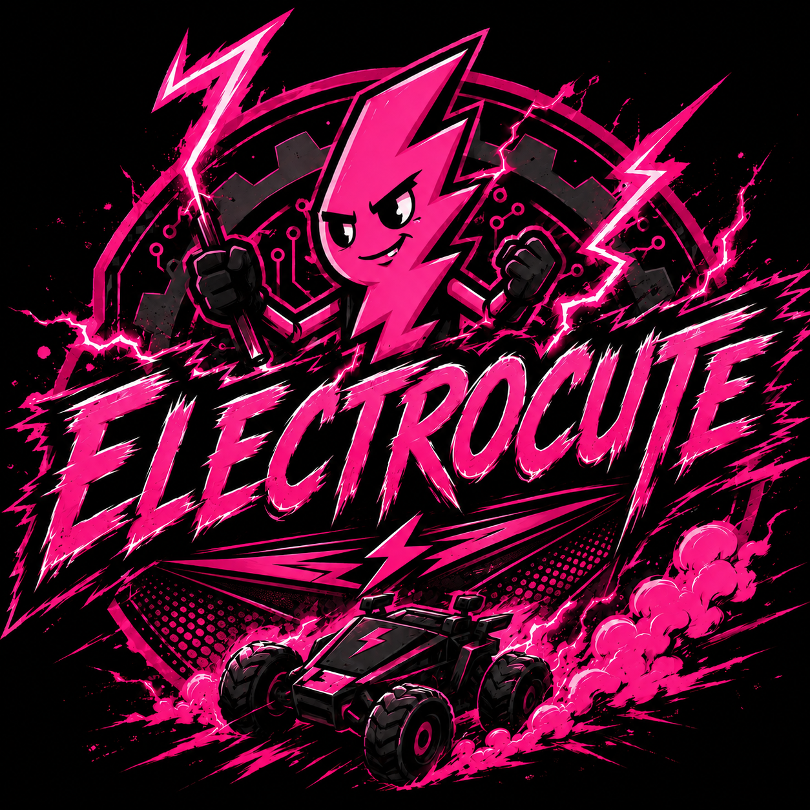

# Hello! We are Team Electrocute

<table>
  <tr>
    <td align="center"><strong>Team Picture</strong><br></td>
  </tr>
</table>

We are a team of three high school students participating in the **World Robot Olympiad (WRO) Future Engineers 2026** category.

| Member           | Role                 |
| ---------------- | -------------------- |
| Vaishvi Shah     | Software & Logic     |
| Avani Devalankar | 3d Design & Hardware |
| Jaitra Bhatt     | Documentation        |

# Overview

The primary objective was to build an autonomous robot capable of navigating a closed course with obstacles and parallel parking itself at the end.

We chose this project because we wanted a challenging experience during high school where we could apply our Python skills while developing new skills in electronics, CAD, and 3D printing. We also drew inspiration from top teams that participated in WRO Future Engineers over the past two years by studying their [GitHub repositories](https://github.com/World-Robot-Olympiad-Association).

Our main objective was to create a dependable and effective system while showcasing our engineering, problem-solving, and teamwork skills. The project also gave us an opportunity to expand our knowledge and develop new skills throughout the process of building our robot.

We approached the development through several stages, beginning with idea generation and research, followed by designing, building, testing, and refining our system. We also kept thorough records of our work to make it easier to share information, track changes, and maintain a consistent workflow throughout the project.

### Summary Video


<a href="https://www.youtube.com/watch?v=VKRCWfLhV6I">
  
</a>

Click above to watch our video!


### Open Challenge Videos


https://github.com/user-attachments/assets/b752e2d7-2efb-4881-ae9d-5aae1f4fcaa4


### Obstacle Video

https://github.com/user-attachments/assets/9520dfca-cd9e-48ff-8d53-4761ecfdaf9c


## Table of Content
Add table of Content 

## Meet The Robot

<table>
  <tr>
    <td align="center"><strong>Team Picture</strong><br></td>
  </tr>
</table>
Meet Batmobile, our autonomous car designed and 3D-printed for WRO Future Engineers 2026. The brain of the robot is a Raspberry Pi 5, which processes the camera feed using OpenCV and handles navigation, obstacle detection, and sensor logic. A Raspberry Pi Pico communicates with the Pi through a USB serial connection and controls the DC motor and steering servo.

Batmobile uses a camera, IMU, and encoder sensor to navigate the field. The camera provides visual information for navigation and obstacle detection, the IMU helps maintain a straight heading and execute accurate turns, and the encoder sensor assists with precise parking. Together, these systems allow Batmobile to independently perceive its surroundings, make decisions, and navigate the competition field.

### Preliminary Work

We found the public WRO repositories especially useful when getting started. Being able to look at documentation from previous teams gave us a reference for how to approach the competition without having to figure everything out from scratch. We’ve tried to do the same with our documentation by making it practical and detailed enough that a future team can use it as a starting point for their own robot.


# Introduction

## Meet The Robot

- Insert robot images

Meet Batmobile, our autonomous car designed and 3D-printed for WRO Future Engineers 2026. The brain of the robot is a Raspberry Pi 5, which processes the camera feed using OpenCV and handles navigation, obstacle detection, and sensor logic. A Raspberry Pi Pico communicates with the Pi through a USB serial port and controls the DC motor and the steering servo.

Batmobile uses a camera, IMU, and encoder sensor to navigate the field. The camera provides visual information for navigation and obstacle detection, while the IMU helps maintain a straight heading. Finally, the encoder assists with precise parking. Together, these systems allow Batmobile to independently perceive its surroundings, make decisions, and navigate the competition field.

## Preliminary Work

We found publicly available WRO repositories from previous teams especially useful during the early stages of our project. Their documentation gave us insight into how other teams approached robot design, programming, electronics, and problem solving. This allowed us to learn from their experiences and use their work as a starting point rather than having to develop every idea from scratch.

As our project progressed, we wanted to contribute to the same community that helped us. We therefore focused on creating documentation that is practical, detailed, and easy to follow. By documenting both our successes and failures, we hope our work can provide a useful starting point for teams developing their own robots.

# Mobility & Mechanical Design

The chassis is built in a layered structure so that mounting space could be divided deliberately, with the first layer holding the heavier components and a second, elevated layer used to mount the electronics. This final version did not happen immediately; we went through many iterations to make it work.

## First Iteration  LEGO Chassis

**Starting Design**

Our first chassis was constructed using LEGO Technic pieces to create a basic structure for initial testing. A LEGO differential was incorporated into the drivetrain system to transfer power to the wheels while allowing them to rotate at different speeds during turns.

**Issues Identified**

During testing, we encountered several mechanical problems. The wheels frequently came off the chassis during movement and turning. The steering system also had a limited Ackermann steering angle, which made it difficult for the robot to perform tight turns. This was especially problematic during parking, where greater steering angles were needed to maneuver within the available space. Additionally, the differential would come off the axle during operation, affecting the reliability of the drivetrain.

<table>
  <tr>
    <td></td>
    <td></td>
  </tr>
  <tr>
    <td></td>
    <td></td>
  </tr>
    <tr>
    <td></td>
    <td></td>
  </tr>
</table>

## Second Iteration  3D-Printed Chassis

### Chassis Design

We replaced the original LEGO chassis with a custom 3D-printed chassis designed specifically around our robot’s components. The chassis was divided into two separate layers to organize the mechanical and electronic components:

- Layer 1: Battery, motor driver, servo, and Ackermann steering system.
- Layer 2: Raspberry Pi 5, Raspberry Pi Pico 2, and IMU.

This two-layer structure provided dedicated mounting areas, improved component organization, and made the overall system easier to assemble and maintain.

### Issues Identified

During testing, we found that placing the battery toward the rear of the chassis caused an uneven weight distribution. This shifted the centre of mass toward the rear, reducing the normal force acting on the front wheels.

With less weight on the front wheels, the available front-wheel traction decreased, particularly during faster movement and sharp turns. At higher speeds, the front wheels would lose traction and lift slightly, which reduced steering effectiveness and made the robot less stable and predictable while turning.

<table>
  <tr>
    <td></td>
    <td></td>
  </tr>
  <tr>
    <td></td>
    <td></td>
  </tr>
    <tr>
    <td></td>
    <td></td>
  </tr>
</table>

## Third Iteration  Physical Fit

<table>
  <tr>
    <td align="center"><strong>Chassis Base</strong><br></td>
  </tr>
</table>

### Chassis & Motor Fit

The chassis was extended after measuring the physical DC motor and discovering that it was longer than the original CAD model. An access hole was added to allow easier access to the motor mounting screws during assembly and maintenance. Finally, the motor clamp geometry was adjusted to improve the fit, including reducing the clamp diameter by 0.25 mm for a tighter connection.

### Chassis & Weight Distribution

The front of the chassis was extended to create more space for parking and make the robot easier to maneuver. We also moved the battery closer to the centre of the chassis to balance the weight more evenly and improve stability.

Additional space was made inside the chassis to fit the updated DC motor, which had different dimensions from the previous motor. We also replaced the previous motor driver with a new motor driver setup, so the layout of the internal components had to be adjusted to fit everything properly.

### Mounting & Fastening

The LEGO peg holes were increased by 0.1 mm after testing showed that the original holes were slightly too small. We also added dedicated mounting holes for the servo so it could be securely attached to the chassis.

Before finalizing the design, we test-fitted each clamp with its corresponding physical component. This helped us check that the dimensions were correct and catch any fitting issues before final assembly.

<table>
  <tr>
    <td></td>
    <td></td>
  </tr>
  <tr>
    <td></td>
    <td></td>
  </tr>
    <tr>
    <td></td>
    <td></td>
  </tr>
</table>

### Accessibility & Wiring

The chassis was designed to keep the wiring and electrical components accessible. This allowed us to easily reach the connections during testing, troubleshooting, and repairs without having to completely disassemble the robot.

### Battery Placement

Initially, the battery was positioned toward the rear of the robot, but this caused uneven weight distribution and shifted the centre of mass backward.

To solve this, we moved the battery toward the centre of the chassis, which distributed the weight more evenly and improved stability and traction during turns.

### Rear Wheel Bearings

We added bearings to the rear wheel axles to reduce friction between the axles and the chassis. This allowed the rear wheels to rotate more smoothly and freely, reducing mechanical resistance and improving the robot's overall movement and consistency.

### Screw Usage

We switched to M3 screws throughout the assembly, replacing the larger fasteners used in earlier versions. This helped reduce the overall weight of the robot while still providing enough strength to securely hold the chassis.

Using one standard screw size also made assembly and part sourcing simpler by reducing the number of different fasteners required.## Drive System

### Motor Selection

### Motor 1: JGA25-371 620 RPM DC Motor

<table>
  <tr>
    <td align="center"><strong></strong><br></td>
  </tr>
</table> 

### Specifications

| Specification | Value |
|---------------|-------|
| Reduction Ratio | 9.6:1 |
| Rated Voltage | 12V |
| Speed | 620 RPM |
| Current | 60 mA |
| Torque | 0.1 kg·cm |
| Speed | 450 RPM |
| Current | 0.45 A |
| Torque | 0.35 kg·cm |
| Current | 1.3 A |

The WRO track is flat, so we did not need the extra stall torque provided by the lower-RPM motors to handle slopes. Instead, we chose the 620 RPM motor because its higher top speed allows the robot to move faster during the open sections of the track, helping us achieve faster lap times.

## Drive System

### Motor 2: Lower-RPM JGA25-371 Variant

<table>
  <tr>
    <td align="center"><strong></strong><br></td>
  </tr>
</table> 

Add pictures

| Specification | Lower-RPM JGA25-371 (~126–280 RPM) |
|---|---|
| Operating voltage | 6–24V (12V nominal) |
| Free-run speed at 12V | ~126–280 RPM depending on ratio |
| Stall torque at 12V | ~2.65–4.2 kg·cm depending on ratio |
| Free-run current at 12V | ~46 mA |
| Encoder | Integrated, ~12 counts/rev |
| Main advantage | Higher torque margin for acceleration and obstacle-course maneuvering |
| Main disadvantage | Lower top speed, resulting in slower lap times on the open/obstacle track |

At a 1:34 ratio, the motor runs at approximately 126 RPM at 12V with roughly 4.2 kg·cm of stall torque, while a 201 RPM version provides approximately 2.65 kg·cm of stall torque.

The higher gear reduction gives the robot more torque at the wheels, which improves acceleration and helps it overcome resistance. However, this also reduces the robot’s maximum speed. Since the WRO track is flat and has open sections where speed is important, we decided that the additional torque was not as useful as having a higher top speed.
## Motor Torque and Acceleration Calculations

These calculations evaluate whether our **695 g robot** can reach the target wheel speed of **150 RPM within 0.5 seconds**, using a **JGA25-371 motor** with **2.5:1 gearing**.

### Parameters

| Parameter | Symbol | Value |
|---|---|---:|
| Robot mass | `m` | 0.695 kg |
| Wheel diameter | `d` | 56 mm |
| Wheel radius | `r` | 0.028 m |
| Motor | — | JGA25-371, 620 RPM |
| Motor stall torque | `Tₛ` | 0.0833 N·m |
| Gear ratio | `R` | 2.5:1 |
| Target wheel speed | `vₜ` | 150 RPM |
| Acceleration time | `t` | 0.5 s |
| Combined efficiency | `η` | 0.90 |
| Rolling resistance coefficient | `Cᵣᵣ` | 0.03 |
| Target linear velocity | `v` | 0.440 m/s |
| Required acceleration | `a` | 0.880 m/s² |
| Acceleration torque at wheel | `Tₐcc` | 0.0171 N·m |
| Rolling resistance torque | `Tᵣᵣ` | 0.00573 N·m |
| Total required wheel torque | `Tᵥ` | 0.0228 N·m |
| Required motor torque | `Tₘ` | 0.0102 N·m |
| Available motor torque @ 375 RPM | `T_available` | ≈ 0.0329 N·m |

### Summary

With the robot mass updated to **695 g**, the required motor torque to accelerate to **150 RPM in 0.5 seconds** is approximately **0.0102 N·m**.

At the corresponding motor speed of **375 RPM**, the JGA25-371 motor provides approximately **0.0329 N·m** of available torque.

Therefore, the motor provides **over 3× the calculated required torque**, giving the robot a sufficient torque margin for the target acceleration and speed.
### Final Decision

We chose the JGA25-371 620 RPM DC Motor because it provides a good balance of speed, torque, and size for our robot. The motor also has an integrated encoder, which allows us to measure its rotation and use that feedback for more accurate speed control.

We paired it with the WLToys 144001 differential, which transfers power to the rear wheels while allowing the wheels to rotate at different speeds when turning. Overall, this setup gave us the speed and control we needed for the WRO track.

| Risk | Mitigation |
|---|---|
| The stall torque for the specific 620 RPM gear ratio is not published by the vendor, so the value is estimated by scaling down from documented lower-RPM variants in the same JGA25-371 family. | Encoder feedback allows the motor's actual RPM to be monitored under load. A significant RPM drop without a corresponding increase in the drive command can indicate that the motor is approaching its available torque limit. This allows a potential torque shortfall to be identified during testing before competition. |

### Steering, Servo & Differential Design

### WLToys 144001

<table>
  <tr>
    <td align="center"><strong></strong><br></td>
  </tr>
</table> 

Our first drivetrain used a LEGO differential to drive the rear wheels, allowing the wheels to rotate at different speeds during turns and reducing wheel scrub. However, the differential axle repeatedly came loose during sharper turns.

To improve reliability and performance, we replaced the LEGO differential with a WLToys 144001 differential, which has a 2.5:1 reduction ratio. This provided a stronger connection, smoother movement, and more consistent turning while eliminating the axle-loosening issue.

Add pictures of differential

### Ackermann Steering

Our initial LEGO robot used Ackermann steering, but when we switched to the custom chassis, the original steering geometry caused the robot to slip whenever it moved. We adjusted the Ackermann steering angle to better suit the new chassis geometry, reducing wheel slip and improving steering stability.

The new linkage also made better use of the servo’s approximately 50°–130° operating range, rather than having its movement restricted by the previous LEGO chassis geometry.

| Position | Angle |
|---|---|
| Center | 82° |
| Full Left | Center - 45° |
| Full Right | Center + 45° |

This was necessary because the inside wheel travels along a smaller circle, while the outside wheel travels along a larger circle. By turning the wheels at different angles, the robot can follow the correct path through a corner and turn more smoothly without the tires dragging across the ground.

| Risk | Mitigation |
|---|---|
| The steering range was originally limited to 0°–90° because of a servo bug discovered during Iteration 1. | We traced and corrected the bug, then tested the servo against the physical Ackermann linkage to determine its actual mechanical limits. |
| Using a steering range beyond the mechanical limits could cause the linkage to bind or damage the components. | We verified a safe 50°–130° range through physical testing and permanently adopted it as the steering limit. Every steering formula in our software clamps its output to this range. |

### Servo: MG90S Servo

<table>
  <tr>
    <td align="center"><strong></strong><br></td>
  </tr>
</table> 

Add picture of servo

### Specifications

| Specification | Value |
|---|---|
| Rated Torque | 1.1 kgf/cm |
| Speed | 0.15 sec/60° |
| Voltage | 5V |
| Gearing | Metal |
| Type | Digital |

We chose the servo because its compact size and PWM control made it well suited for steering. Its torque was enough to move the front wheels reliably and respond quickly to steering commands. It is also commonly used in robotics, so finding documentation and compatible mounting hardware was straightforward.

After considering several steering options, we selected Ackermann steering geometry because it reduces tire slip and improves turning accuracy. The inside and outside front wheels turn at different angles, allowing each wheel to follow its own turning path. Our steering linkage is arranged so that the projected lines of the front wheels meet near the rear axle, creating the desired Ackermann geometry.

# Power & Sensor Architecture

## Component Placement

<table>
  <tr>
    <td></td>
    <td></td>
  </tr>
  <tr>
    <td></td>
    <td></td>
  </tr>
</table> 

## Microcontroller Selection & Development

The microcontroller handles the robot's low-level control, including the motor, steering servo, and IMU, while communicating with the Raspberry Pi 5 for higher-level processing and decision-making.

### Iteration 1: micro:bit

<table>
  <tr>
    <td align="center"><strong></strong><br></td>
  </tr>
</table> 

The micro:bit is a compact board based on the Nordic nRF52833. It includes an accelerometer, magnetometer, Bluetooth, LED matrix, and two buttons.

- Advantage: Easy to program and quick to test.
- Disadvantage: Limited motor and servo control.
- Testing: The Raspberry Pi connection was unreliable.

### Raspberry Pi Pico 2 W

<table>
  <tr>
    <td align="center"><strong></strong><br></td>
  </tr>
</table> 

The Raspberry Pi Pico 2 W uses the RP2350 and has Wi-Fi, Bluetooth, and 26 GPIO pins. It does not have built-in sensors, but it can connect to many sensors and devices.

- Main advantage: It has many GPIO pins and supports PWM, I²C, SPI, and UART.
- Main disadvantage: It required more setup and testing to get all of our hardware communicating correctly.
- Final solution: After testing and configuring the Pico 2 W, we were able to reliably control the motor and servo while communicating with the Raspberry Pi 5.

## Raspberry Pi 5

<table>
  <tr>
    <td align="center"><strong></strong><br></td>
  </tr>
</table> 

No second board was tested against the Raspberry Pi 5. It was selected at the beginning of the design because the robot's navigation system requires real-time processing of camera data for lane, wall, and pillar detection.

| Specification | Raspberry Pi 5 (4GB) |
|---|---|
| CPU | Broadcom BCM2712, quad-core Cortex-A76 @ 2.4 GHz |
| RAM | 4GB LPDDR4X |
| Camera interface | MIPI CSI-2 |
| Connectivity | Gigabit Ethernet, Wi-Fi, Bluetooth, USB 3.0 |
| Cooling | Active cooling required under sustained load; heatsink and fan used |
| BOM reference cost | $153.95 CAD |
| Main advantage | Sufficient CPU headroom for real-time computer vision |
| Main disadvantage | Highest power draw and cooling requirement of the computing boards |

The Raspberry Pi 5 was chosen because the robot needs to process live camera video to detect lanes, walls, and pillars.

- Main advantage: It has enough processing power to handle real-time camera and computer vision tasks.
- Main disadvantage: The Raspberry Pi 5 has higher power consumption, which puts more demand on the robot's battery.
- Cooling: Active cooling was added to prevent overheating during long periods of use.

#### MPU6050

<table>
  <tr>
    <td align="center"><strong></strong><br></td>
  </tr>
</table> 

The MPU6050 is a 6-DOF IMU containing a 3-axis accelerometer and 3-axis gyroscope, but it does not include a magnetometer. It provides raw accelerometer and gyroscope measurements rather than directly providing a fully processed orientation estimate. Its main advantages are its low cost, small size, and high output rate of up to 1000 Hz, which would provide more than enough measurements for a fast steering control loop.

#### BNO055

<table>
  <tr>
    <td align="center"><strong></strong><br></td>
  </tr>
</table> 

The BNO055 is a 9-DOF IMU containing a 3-axis accelerometer, 3-axis gyroscope, and 3-axis magnetometer. Instead of requiring the Raspberry Pi Pico 2 W to perform all of the sensor-fusion calculations, the BNO055 can provide ready-to-use orientation data. The main trade-off is that the BNO055 is more expensive and has a lower output rate than the MPU6050.

### Comparison Table

| Specification | MPU6050 | BNO055 |
|---|---|---|
| Degrees of freedom | 6-DOF | 9-DOF |
| Accelerometer | 3-axis | 3-axis |
| Gyroscope | 3-axis | 3-axis |
| Magnetometer | No | 3-axis |
| Sensor-fusion processor | Host microcontroller required | 32-bit Cortex-M0+ |
| Maximum output rate | Up to 1000 Hz | — |
| Fusion output rate | — | Approximately 100 Hz |
| Orientation processing | Host microcontroller required | Integrated sensor fusion |
| Current in 9-DOF fusion at 100 Hz | — | Approximately 12.3 mA |
| Orientation output | — | Euler angles and quaternions |
| Interfaces | — | I²C, UART |
| Typical / BOM reference cost | Approximately $3–10 | $38.38 CAD |
| Main advantage | Low cost and high output rate | Integrated sensor fusion and improved heading reference |
| Main disadvantage | Yaw drift and additional sensor-fusion software | Higher cost and lower output rate |

### Final Decision

The BNO055 was selected because reliable heading information was more important for our robot than the MPU6050's lower cost and higher output rate. Our main reason for using an IMU was to maintain the robot's heading when the camera could not provide reliable information, such as during blind spots and parking turns. This made stable yaw information especially important.

The BNO055's magnetometer provides a magnetic reference that helps reduce the effects of gyroscope drift, while its onboard sensor fusion handles much of the orientation processing for us. Although the BNO055 costs more and has a lower output rate, we accepted these trade-offs because it gave us simpler software and more reliable heading control.

# Motor Driver Iterations

### Iteration 1 — DRV8871

<table>
  <tr>
    <td align="center"><strong></strong><br></td>
  </tr>
</table> 

We initially chose the DRV8871 because it was compact, efficient, and its single-channel design was sufficient for our one-motor drivetrain. During testing, we found that it could not handle the voltage and current conditions from our 12 V motor system and eventually burned out.

### Iteration 2 — L298N

<table>
  <tr>
    <td align="center"><strong></strong><br></td>
  </tr>
</table> 

We replaced the DRV8871 with an L298N. The L298N is a dual H-bridge, so the second motor channel is unused in our application. It is larger and has a voltage drop of approximately 1.5–2 V, meaning our motor receives around 10–10.5 V from the nominal 12 V battery. However, it handled our motor's operating conditions reliably during testing, so we selected it for the final robot.

### Comparison Table

| Specification | DRV8871 | L298N |
|---|---|---|
| Motor channels | 1 | 2 |
| Driver type | Single H-bridge | Dual H-bridge |
| Voltage drop | Low | Approximately 1.5–2 V |
| Motor voltage from 12 V battery | Up to motor supply voltage | Approximately 10–10.5 V |
| Thermal management | Integrated thermal protection | Heatsink / high thermal mass |
| BOM reference cost | $6.99 CAD | $11.99 CAD |
| Main advantage | Compact, efficient, and single-channel | Reliable under our tested conditions |
| Main disadvantage | Could not handle our tested 12 V system | Larger size and higher voltage loss |

### Final Decision

We selected the L298N as our final motor driver because it proved to be the most reliable option during testing. Although it is larger and has a higher voltage drop than the DRV8871, it was able to consistently handle the operating conditions of our 12 V motor system without overheating or failing. For our robot, reliability was more important than having a smaller and more efficient driver, so the L298N was the better choice for the final design.

# Camera: OV5647 Wide-Angle Camera

<table>
  <tr>
    <td align="center"><strong></strong><br></td>
  </tr>
</table> 

The camera listed in our BOM is the SainSmart Wide-Angle 5MP camera with the OV5647 sensor, which has a 160° field of view. The wide field of view allows the robot to see a larger area of the track and its surroundings compared to a narrower camera.

We use the camera for several parts of our navigation system, including lane, wall, and pillar detection. This allows one sensor to provide multiple types of information to the robot instead of requiring separate sensors for each feature.

The main advantage of using a wide-angle camera is its versatility and coverage. However, visual detection can become less reliable when parts of the track are blocked or when lighting and visibility make features harder to detect. Overall, the camera provides the range of visual information needed for our navigation system while keeping the sensor setup relatively simple.

# Parking: TOF Sensor vs. Motor Encoder

<table>
  <tr>
    <td align="center"><strong></strong><br></td>
  </tr>
</table> 

For parking, we considered two options: a VL53L0X Time-of-Flight (TOF) sensor and the motor encoder already built into our JGA25-371 motor. We compared them based on accuracy, reliability, hardware requirements, and how easily they could be integrated into our existing system.

The VL53L0X is a Time-of-Flight distance sensor that uses infrared light to measure the distance to an object. It can measure distances up to approximately 2 m and communicates with the Raspberry Pi Pico 2 W through I²C. Its main advantage is that it measures the environment directly, so wheel slip does not directly affect the measured distance. However, its limited field of view makes its accuracy dependent on the sensor’s position and orientation. It would also add another I²C device for a task that could be done using hardware already built into our drivetrain.

The JGA25-371 motor has an integrated encoder that allows the Raspberry Pi Pico 2 W to monitor motor rotation and estimate how far the robot has travelled. Our selected 9.6:1 motor has a listed no-load speed of approximately 620 RPM, a rated-load speed of approximately 500 RPM, and approximately 0.9 kg·cm of rated-load torque. The main advantage is that the encoder reuses hardware already built into the drivetrain, so no additional distance sensor is needed. The trade-off is that it measures wheel movement rather than the robot’s actual position, meaning wheel slip and small differences in wheel diameter can introduce error.

### Comparison Table

| Feature | VL53L0X TOF Sensor | Motor Encoder |
|---|---|---|
| Measurement | Direct distance to an object | Estimated distance from wheel rotation |
| Communication | I²C | Encoder signal |
| Additional hardware | Requires a separate sensor | Already integrated into the motor |
| Affected by wheel slip | No | Yes |
| Main advantage | Measures the robot's actual distance from its surroundings | Reuses existing hardware and simplifies the system |
| Main disadvantage | Limited field of view and requires another I²C device | Distance can be affected by wheel slip and wheel diameter |
| Selected for parking | No | Yes |

### Final Decision

We selected the motor encoder for parking because the parking area provides a relatively controlled environment where repeatable wheel movement is sufficient for our parking sequence. Using the encoder also simplifies our sensor architecture by removing a dedicated distance sensor and reducing the number of devices using the I²C bus.

This allowed us to keep the BNO055 as our primary I²C sensor while using the existing motor encoder for the distance information needed during parking. Although the encoder can introduce some error from wheel slip, the simpler setup and reuse of existing hardware made it the better choice for our robot.

#### Control, Display & Support System

The robot uses several supporting electronic components to improve the reliability, organization, and usability of the overall system. These components handle connections between the main electronics, provide information during testing, and regulate power for the robot’s different systems.

The Waveshare Servo Driver Board was selected because it plugs directly into the Raspberry Pi Pico 2 W and provides convenient connections for the servo and motor driver. This reduces the number of loose jumper-wire connections, making the wiring more compact, secure, and easier to manage.

The Waveshare Pico-LCD-1.44 was added to provide on-robot status information and debugging without requiring a laptop. Its 128 × 128 SPI display and four buttons allow the team to view robot information and run test routines directly on the robot during testing.

The XL4015 buck converter was selected to efficiently reduce the battery voltage while producing less heat than a linear regulator. Its roughly 90%+ efficiency helps reduce wasted energy, which is important for a battery-powered robot. The converter was also positioned away from the IMU and I²C wiring to reduce the effects of switching noise.

### Comparison Table

| Specification | MPU6050 | BNO055 |
|---|---|---|
| Degrees of freedom | 6-DOF | 9-DOF |
| Accelerometer | 3-axis | 3-axis |
| Gyroscope | 3-axis | 3-axis |
| Magnetometer | No | 3-axis |
| Sensor-fusion processor | Host microcontroller required | 32-bit Cortex-M0+ |
| Maximum output rate | Up to 1000 Hz | — |
| Fusion output rate | — | Approximately 100 Hz |
| Orientation processing | Host microcontroller required | Integrated sensor fusion |
| Current in 9-DOF fusion at 100 Hz | — | Approximately 12.3 mA |
| Orientation output | — | Euler angles and quaternions |
| Interfaces | — | I²C, UART |
| Typical / BOM reference cost | Approximately $3–10 | $38.38 CAD |
| Main advantage | Low cost and high output rate | Integrated sensor fusion and improved heading reference |
| Main disadvantage | Yaw drift and additional sensor-fusion software | Higher cost and lower output rate |

### Final Decision

The BNO055 was selected because reliable heading information was more important for our robot than the MPU6050's lower cost and higher output rate. Our main reason for using an IMU was to maintain the robot's heading when the camera could not provide reliable information, such as during blind spots and parking turns. This made stable yaw information especially important.

The BNO055's magnetometer provides a magnetic reference that helps reduce the effects of gyroscope drift, while its onboard sensor fusion handles much of the orientation processing for us. Although the BNO055 costs more and has a lower output rate, we accepted these trade-offs because it gave us simpler software and more reliable heading control.

# Final Circuit Architecture


<table>
  <tr>
    <td align="center"><strong></strong><br></td>
  </tr>
</table> 

<table>
  <tr>
    <td align="center"><strong></strong><br></td>
  </tr>
</table> 

## Main Battery: 12V Li-ion Pack

<table>
  <tr>
    <td align="center"><strong></strong><br></td>
  </tr>
</table> 

A 12V Li-ion battery pack was selected to provide the required voltage for the drivetrain without needing a step-up converter. The battery provides enough capacity for the robot while fitting within the chassis without adding excessive weight.

The 12V output matches the nominal voltage of the drive motor and L298N motor driver, avoiding the added complexity and power losses of a step-up converter. The Li-ion chemistry also provides high energy density, allowing the required capacity to fit within the robot. Finally, the battery is mounted low and centrally in the chassis to improve stability and distribute the weight more evenly across the four wheels.

| Specification | 12V Li-ion Battery Pack |
|---|---|
| Chemistry | Lithium-ion |
| Nominal pack voltage | 12V |
| Rated capacity | 8800 mAh |
| BOM reference cost | $27.99 CAD |
| Main advantage | Matches the drivetrain's 12V nominal voltage |
| Main disadvantage | Requires appropriate protection and charging procedures |

## Steering Servo: MG90S vs. SG90

### SG90

<table>
  <tr>
    <td align="center"><strong></strong><br></td>
  </tr>
</table> 


The SG90 is a low-cost micro servo with plastic internal gears. It is easy to find and suitable for lightweight applications, but the plastic gears are more likely to strip under repeated stall or impact loads. This is a concern for steering because the servo can experience sudden loads when a wheel contacts a wall, pillar, or other obstacle.

### MG90S

<table>
  <tr>
    <td align="center"><strong></strong><br></td>
  </tr>
</table> 

The MG90S is similar in size to the SG90 but uses metal internal gears, making it better suited for the repeated mechanical loads experienced by the steering system.

### Comparison Table

| Specification | SG90 | MG90S |
|---|---|---|
| Gear material | Plastic | Metal |
| Stall torque | Approximately 1.5–1.8 kg·cm at 4.8–6V | Approximately 1.8–2.2 kg·cm at 4.8–6V |
| Operating voltage | 4.8–6V | 4.8–6V |
| BOM reference cost | $4.99 CAD | $17.02 CAD per pair |
| Main advantage | Very low cost and easy availability | Greater resistance to repeated stall and impact loads |
| Main disadvantage | Plastic gears can strip under heavy loading | Higher cost than the SG90 |

The MG90S was selected because steering can expose the servo to sudden mechanical loads. Its metal gear train provides greater durability than the plastic gears in the SG90. The higher cost was accepted because steering reliability was more important than saving a small amount on a component that could cause a mechanical failure during a run.

## Chassis Material: 3D-Printed PLA-CF

The chassis needs sufficient stiffness to maintain consistent camera, sensor, and steering geometry while the robot is moving. PLA-CF was selected because it provides this stiffness while still allowing the team to quickly modify and reprint parts as the design changed. The multi-layer structure also separates the high-current drivetrain components from the more sensitive sensing and computing electronics.

| Specification | 3D-Printed Chassis (PLA-CF) |
|---|---|
| Material | PLA reinforced with chopped carbon fibre |
| Structure | Multi-layer frame connected with brass standoffs |
| Reference cost | Approximately $25 CAD per spool |
| Main advantage | Stiff, relatively lightweight, and printable in-house |
| Main disadvantage | More abrasive on nozzles and requires a hardened nozzle |

## Wheels: LEGO Wheels and Tires

<table>
  <tr>
    <td align="center"><strong></strong><br></td>
  </tr>
</table> 

Using LEGO wheels reduced the amount of mechanical design and testing required for the drivetrain. This allowed the team to focus development time on the chassis, steering geometry, and motor system. The main trade-off is that wheel size and tire options are limited to what is available within the LEGO ecosystem.

| Specification | LEGO Wheels, Axles and Connectors |
|---|---|
| Tire material | Rubber tire over a plastic hub |
| Axle interface | Standard LEGO Technic cross-axle |
| Reference cost | Approximately $50 CAD |
| Main advantage | Off-the-shelf wheel and axle system with reliable traction |
| Main disadvantage | Limited selection of wheel sizes compared with a custom system |

# Power System Architecture


## Two Board Architecture

The Raspberry Pi 5 acts as the robot’s main decision-making computer. It processes the camera input and runs the higher-level logic in Python, including lane following, obstacle avoidance, and the state machine. The Pi 5 sends movement commands to the Raspberry Pi Pico 2 W, which acts as the real-time controller.

The Pico runs a single program directly from flash instead of a full operating system, allowing it to handle low-latency control tasks reliably. It reads the BNO055 IMU directly and converts commands from the Pi 5 into low-level signals for the MG95S servo and L298N motor driver. The Pico can also send status information back to the Pi 5, allowing the two boards to communicate during operation.

### Why Two Boards?

The split is based on the strengths of each board:

- Pi 5 → High-level processing: camera processing, decision logic, and state machine.
- Pico 2 W → Real-time control: IMU reading, PWM generation, servo control, and motor commands.

This prevents heavy camera processing from interfering with the timing-sensitive steering and motor control.

### Power Distribution

The L298N motor driver receives power from the external battery and supplies the required current to the motor, since the Raspberry Pi Pico 2 W cannot safely power the motor directly. The Pico and other electronics use their appropriate regulated power supplies, while the motor receives power through the L298N.

All components share a common ground, which provides the same electrical reference for the control signals between the Raspberry Pi 5, Pico, and motor driver. This allows the control signals to be read reliably across the system.

## Power Distribution Diagram: Nominal Values

- Add power distribution diagram here.
- Add second power distribution image here.

## Nominal Current Draw for Each Part

| Part | Channel | Nominal Draw | Basis |
|---|---|---|---|
| Raspberry Pi 5 (board) | Pi 5 | ~800 mA @ 5 V | Idle draw is roughly 4 to 5 W, increasing toward 12 W under heavy CPU/USB load. |
| Sainsmart 5MP Camera | Pi 5 | ~250 mA | OV5647-based Raspberry Pi camera modules are commonly rated around 300 mA peak. The estimated running draw is slightly below this. |
| Encoder (Hall-effect) | Pi 5 | ~10 mA | Two-channel Hall-effect encoders on small gearmotors draw a maximum of about 10 mA. |
| Pi 5 channel total | — | ≈1.06 A | Sum of the three components above. |
| Raspberry Pi Pico 2 W (board) | Pico | ~100 mA @ 5 V | Community measurements for Pico/Pico W boards are typically in the 80 to 130 mA range. |
| MG90S Servo | Pico | ~150 mA average | These servos draw about 10 mA when idle and 120 to 250 mA while moving, with a stall current of up to about 800 mA. |
| BNO055 IMU | Pico | ~12 mA | The maximum total supply current for the BNO055 is 12.3 mA. |
| L298N Logic Pin | Pico | ~36 mA | The L298N module's logic supply draws 0 to 36 mA. |
| Pico channel total | — | ≈0.30 A | Sum of the four components above. |
| Buck Converter Output | Both channels | ≈1.36 A | Sum of the Pi 5 and Pico channel totals. |
| DC Gear Motor | L298N | ~300 mA nominal (estimated) | A 12 V JGA25-370-style gearmotor draws about 50 mA at no load and up to 1200 mA when stalled. |

## Power Budget

### 5 V Power Requirement

The 5 V rail powers the Raspberry Pi 5 and Raspberry Pi Pico 2 W. The connected electronics require approximately 6.8 W. Accounting for approximately 85% buck converter efficiency, the battery must supply:

$$
P_{battery} = \frac{6.8W}{0.85} \approx 8.0W
$$

### Motor Power

The drive motor draws approximately 0.300 A at 12 V through the L298N motor driver.

$$
P_{motor} = 12V \times 0.300A = 3.6W
$$

Therefore, the estimated total system power is:

$$
P_{total} = 8.0W + 3.6W = 11.6W
$$

### Total System Requirement

At a nominal battery voltage of 12 V, the total system power corresponds to approximately:

$$
I_{battery} = \frac{11.6W}{12V} \approx 0.97A
$$

For a 3.0 Ah battery rated for 1C continuous discharge, the maximum continuous current is:

$$
I_{max} = 3.0Ah \times 1C = 3.0A
$$

The theoretical continuous runtime is:

$$
t = \frac{3.0Ah}{0.97A} \approx 3.1\text{ hours}
$$

## Why This Matters

- The Raspberry Pi 5 is the dominant load on the 5 V rail. At approximately 800 mA, it draws more than three times the current of the entire Pico channel combined. This means it accounts for most of the electronics power consumption, even though it is not directly responsible for moving the robot.
- The calculated 3.1-hour runtime is much longer than a WRO competition run, which typically lasts only a few minutes per heat. This gives the robot a large margin for real-world conditions such as voltage sag, increased motor load, stall current, and temporary steering-current spikes.
- At an estimated 0.97 A, the robot uses only about 32% of the battery's 1C continuous-discharge limit. This means the battery was not selected to operate close to its maximum current rating.


# Programming Logic

## Open Challenge Logic

The Open Challenge uses a combination of camera-based wall following and IMU heading control to navigate the field. The algorithm is as follows:

### 1. Get Sensor Inputs

- The Raspberry Pi captures a 320 × 240 camera feed and reads the robot's heading from the BNO055 IMU.
- The camera uses separate ROIs to detect the left/right black walls and blue/orange turn markers.

### 2. Calculate Steering

- The camera calculates a steering correction based on the difference in wall area between the left and right sides.

$$
cam\_steer = DEFAULT\_STEER\_ANGLE + KP \times (left\_area - right\_area)
$$

- The IMU calculates a correction based on the difference between the current and desired heading.

$$
gyro\_steer = DEFAULT\_STEER\_ANGLE - KP\_GYRO \times heading\_error
$$

- The final steering value combines both corrections, with the IMU given a higher weight:

$$
steering\_value = 0.7 \times gyro\_steer + 0.3 \times cam\_steer
$$

<table>
  <tr>
    <td align="center"><strong></strong><br></td>
  </tr>
</table> 

### 3. Clamp Steering

$$
steering\_value = max(45, min(135, steering\_value))
$$

This helps keep the steering within the Ackermann steering range.

### 4. Check for Bottom Lines

- Blue markers indicate a counter-clockwise turn and orange markers indicate a clockwise turn.
- The first detected colour locks the direction for the run.
- `SAFE_TURN_AREA` sets the minimum area needed before the robot makes a turn, helping it avoid turning too early in different course configurations.


IF left_area > SAFE_TURN_AREA:
    turn(direction)

## Obstacle Challenge Code

The obstacle avoidance section works alongside wall following, using colour detection to find red and green blocks and steer around them instead of through them. The algorithm is as follows:

<table>
  <tr>
    <td align="center"><strong></strong><br></td>
  </tr>
</table>

### 1. Detect an obstacle

- A dedicated `middle_frame` ROI spanning the full frame width watches for red and green contours.
- An obstacle is detected when either colour exceeds the detection threshold:

`obs_on_screen = red_area > 100 or green_area > 100`

- The robot enters `AVOIDING_OBSTACLE` from `WALL_FOLLOW` as soon as either area crosses the threshold, unless a turn is already pending.

### 2. Select the obstacle to react to

- Contours are filtered to real blobs with an area greater than `400 px` across both colours.
- They are sorted by how close their bottom edge is to the bottom of the frame, so the nearest obstacle is selected:

`closest_contour, obstacle_color = all_contours[0]`

### 3. Find the gap to steer through

- The pass-side corner of the obstacle's bounding box is used:
  - **GREEN:** bottom-left corner, since the robot passes on the left.
  - **RED:** bottom-right corner, since the robot passes on the right.
- A band of rows around the obstacle's own row is searched in the **opposite wall's ROI** for the nearest black pixel, stored as `black_wall_x`.
- The target point is calculated as the midpoint between the obstacle's corner and the detected wall position.

### 4. Steer toward the gap

- The camera error is calculated relative to the centre of the frame:

`cam_error = target_x - frame_center_x`

- Steering is calculated using a proportional controller:

`steering = DEFAULT_STEER_ANGLE + KP_OBSTACLE * cam_error`

- The steering angle is limited to a safe range:

`steering = max(45, min(135, steering))`

- This is a **camera-only steering method**, with no gyro blending.

<table>
  <tr>
    <td align="center"><strong></strong><br></td>
  </tr>
</table>

### 5. Safety check — too close to the wall

- If the obstacle is on the "wrong side" and its bottom edge has passed **75% of the ROI height**, the obstacle is considered too close.
- The robot enters the `REVERSING` state.
- It backs up for **1 second** before attempting to avoid the obstacle again.

### 6. Check if the obstacle is cleared

- The robot checks whether it has reached the desired position beside the obstacle:

`obstacle_reached = |cam_error| < OBSTACLE_REACHED_PX and |cam_error_y| < OBSTACLE_REACHED_PY4`

- This ensures that the robot has reached the desired position beside the obstacle.
- The obstacle is considered avoided when it is either completely out of view or `obstacle_reached` is true while the obstacle is still visible.
- Once cleared, the robot returns to `WALL_FOLLOW`.

<table>
  <tr>
    <td align="center"><strong></strong><br></td>
  </tr>
</table>

### Parking States

`OUT_PARKING` and `IN_PARKING` are both parking states that occur once during the challenge:

- `OUT_PARKING` occurs once at the **very beginning**.
- `IN_PARKING` occurs once at the **very end**.

### Running the Program

To run the program without a connected display, ensure that the `SHOW_VID` variable is set to `False`.


```text

```python
SHOW_VID = False


